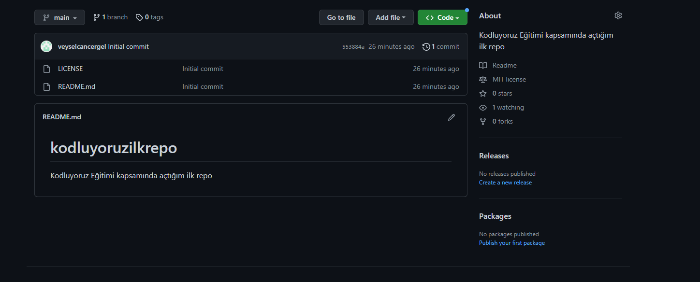

# kodluyoruzilkrepo 

Kodluyoruz Eğitimi kapsamında açtığım ilk repo



## Installation

Öncelikle projeyi clonelayın. 

```
git clone https://github.com/veyselcancergel/kodluyoruzilkrepo.git
```

## Usage
Visual Studio Code  programında açınız

Linux için:

```
cd kodluyoruzilkrepo
code .
```

## Contributing

pull requestler kabul edilir. Büyük değişiklikler için neyi değiştirmek istediğinizi tartışmak için bir konu açınız 

## License

[MIT](https://github.com/veyselcancergel/kodluyoruzilkrepo/blob/main/LICENSE)

